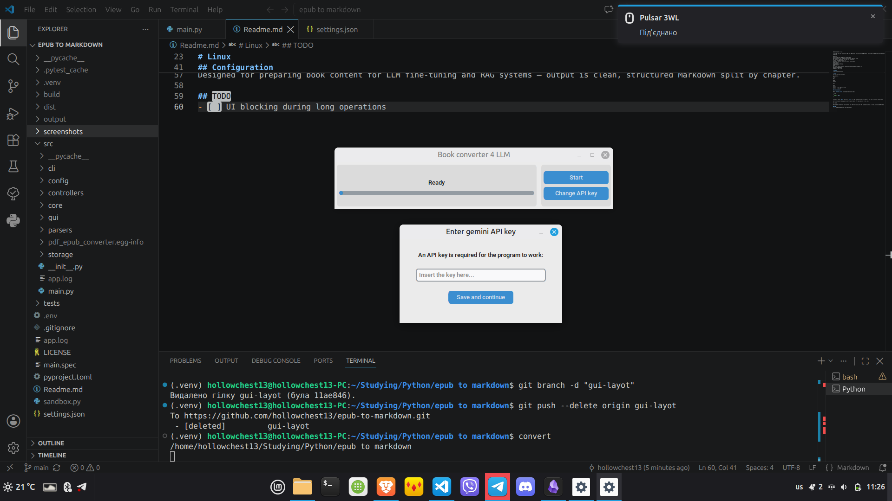

Book Converter 4 LLM

A CLI/GUI tool for converting PDF and EPUB files into structured Markdown, optimized for RAG (Retrieval-Augmented Generation) pipelines.

Features
Converts PDF and EPUB files to Markdown
Splits output into chapters/sections as separate files
GUI mode for easy use, CLI mode for automation
Powered by Google Gemini API
Automatic fallback to CLI if GUI is unavailable
Requirements
Python 3.12+
Google Gemini API key

# Installation

```bash
git clone https://github.com/hollowchest13/epub-to-markdown.git
cd epub-to-markdown
python -m venv .venv
```

# Windows

```cmd
.venv\Scripts\activate
pip install .
```

# Linux

```bash
source .venv/bin/activate
pip install .
```
# Usage

GUI:

```bash
convert
```

CLI:

```bash
convert
convert --dir /path/to/files
convert --set-key
```
## Screenshots



## Configuration

Edit `settings.json` to change the launch mode:

```json
{
  "mode": "gui"
}
```

Available modes: `gui` (default), `cli`. The app automatically falls back to CLI mode if GUI is unavailable.

On first launch the app will ask for your Gemini API key and save it to .env.

Use Case

Designed for preparing book content for LLM fine-tuning and RAG systems — output is clean, structured Markdown split by chapter.

## TODO
- [ ] UI blocking during long operations